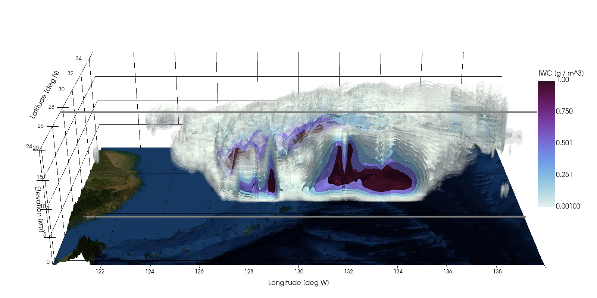

A manuscript detailing this work has been submitted to a scientific journal.
A link to the manuscript will appear here when it is made public.

<h2>Interactive TIWC in typhon Nanmadol</h2>

<small>Opens in a new window</small>

 
  

---

<h2>Mid-latitude cyclone</h2>

 
  <video src="https://user-images.githubusercontent.com/28195522/266222197-67f2182f-7fa7-4f0c-9bed-d25568d047db.mp4" controls="controls" style="width:100%;height:100%;" title="Mid-latitude cyclone">
  </video>

---

<h2>TIWP evolution for January 2020</h2>

 
  <video src="https://user-images.githubusercontent.com/28195522/266384146-9e1e89eb-1b68-46a7-8c63-3788b41b73d7.mp4" controls="controls" style="width:100%;height:100%;" title="TIWP evolution for January 2020">
  </video>

---

<h2>TIWC average for 2020</h2>

 
  <video src="https://user-images.githubusercontent.com/28195522/266385242-237043c8-86f3-4a1e-9b2a-c97c8b79a5a3.mp4" controls="controls" style="width:100%;height:100%;" title="TIWC average for 2020">
  </video>

